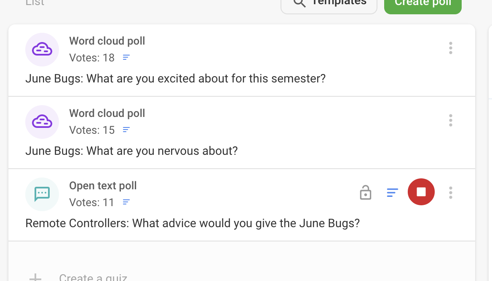

# Runbook for Pre-Course and O-Week

- [Runbook for Pre-Course and O-Week](#runbook-for-pre-course-and-o-week)
  - [Introduction](#introduction)
  - [Course philosophy](#course-philosophy)
  - [Terminology](#terminology)
- [Before O-Week](#before-o-week)
- [Course delivery](#course-delivery)
  - [Overview](#overview)
  - [Tools used](#tools-used)
- [Class meeting guide](#class-meeting-guide)
  - [Day 1: Morning - Welcome event](#day-1-morning---welcome-event)
  - [Day 1: Afternoon](#day-1-afternoon)
  - [Day 2: Morning - Meet the previous cohort](#day-2-morning---meet-the-previous-cohort)
  - [Day 3: Morning - Talent Engine, Remote Handbook & Accountability Groups](#day-3-morning---talent-engine-remote-handbook--accountability-groups)
  - [Day 4: Morning - Team Agreements](#day-4-morning---team-agreements)
  - [Day 5: Morning - Introduction to Tegan from Learner Support, and a Quiz!](#day-5-morning---introduction-to-tegan-from-learner-support-and-a-quiz)
- [Pre O-week Learner Tasks](#pre-o-week-learner-tasks)
  - [Task 1: Getting started with Google Classrooms](#task-1-getting-started-with-google-classrooms)
  - [Task 2: Set up your Mac](#task-2-set-up-your-mac)
  - [Task 3: Register your iMac with an Apple ID](#task-3-register-your-imac-with-an-apple-id)
  - [Task 4: Install a new web browser](#task-4-install-a-new-web-browser)
  - [Task 5: Say hello in slack](#task-5-say-hello-in-slack)
  - [Task 6: Test your google meet setup](#task-6-test-your-google-meet-setup)
- [O Week Learner Material](#o-week-learner-material)
  - [Monday](#monday)
    - [Agenda:](#agenda)
    - [Tech Lead/TA Notes:](#tech-leadta-notes)
  - [Tuesday](#tuesday)
    - [Agenda:](#agenda-1)
    - [Tech Lead/TA Notes:](#tech-leadta-notes-1)
  - [Wednesday](#wednesday)
    - [Agenda:](#agenda-2)
    - [Tech Lead/TA Notes:](#tech-leadta-notes-2)
  - [Thursday](#thursday)
    - [Agenda:](#agenda-3)
    - [Tech Lead/TA Notes:](#tech-leadta-notes-3)
  - [Friday](#friday)
    - [Agenda:](#agenda-4)
    - [Tech Lead/TA Notes:](#tech-leadta-notes-4)

---

## Introduction

Use the following material as a guide to run the Pre-Course and O-Week delivery.

This runbook is a living document, and you can modify and adapt it as you refine the delivery of this course. Add or replace meeting examples as required.

---

## Course philosophy

- This course is a prerequisite to commencing any initial DI course and aims to establish setting up learner environments.

- We believe that this will help reduce technological blocks moving forward into the curriculum and establish consistancy in learning environments among learners.

---

## Terminology

- **DI:** Developers Institute.
- **Learners:** aka students. Our customers essentially.
- **TA:** Teaching assistant. To assist the Tech Lead & to assist the learners.
- **Tech Lead:** aka instructor or teacher. Responsible for organising & delivering this course to the learners.

---

# Before O-Week

A lot needs to happen before learners join us for their first day. Refer to the [Preparation for Orientation Week - Process](https://github.com/Developers-Institute-Internal/handbook-md/wiki/O-Week-Process) in the handbook to see tasks that need to be done. In particular, search for tasks that are assigned to `Tech Lead and TA`

---

# Course delivery

## Overview

- Pre Course setup
- O Week

## Tools used

- Google Classroom: The course schedule is delivered using Google Classroom. This is where learners can understand what they will be working on prior to commencing their journey and what their first week at DI will entail.

---

# Class meeting guide

- Formal class meetings are not required for delivering this onboarding course, however the below example is still recommended to familiarise yourself with and it would be good to setup 1-2 introductory meetings for new cohorts in o-week.
- Recommendations for Tuesday morning Intro & google classroom tutorial and Friday morning debrief of week & segway to curriculum.
- Also a good opportunity to introduce new cohort to other learners/staff, talent engine program, team building exercises. Example videos of some of these below.
- Watch [how to use the class meeting guide](https://www.loom.com/share/ed630a1904d242dfb77dc7d18c2c83e8) for an example of how you might use this in google calendar to achieve this.

### Day 1: Morning - Welcome event

You will be invited to this meeting by operations. It's an all company event where learners are introduced to Developers Institute. You may be expected to talk at this event, check with the meeting organiser.

---

### Day 1: Afternoon

Learners can work through Day 1 in Google Classrooms

---

### Day 2: Morning - Meet the previous cohort

#### Meeting Agenda

We are going to start this week by meeting the cohort ahead of you who completed Client Side last term

There will be opportunity for you to ask questions, and for them to answer questions, as well as introductions and sharing

#### Learning Objectives

- Let learners communicate as a group how they are feeling as they start the course
- Allow previous learners to share their experience to hopefully put them at ease

#### Tech Lead notes

As these groups are very large (around 60 people in the call), you can use a tool like [Slido](https://www.sli.do/) to facilitate the meeting with word clouds. An example of questions you could ask in Slido:

General format of the meeting:

- Bring up the Slido, and give the new cohort 5 mins to capture what they are excited about. As words appear on the word clouds discuss the topics raised, with validation, or ask for clarification to get discussion happening. Timebox yourself to 10mins
- Do the same for the next question - what are you nervous about
- For the last slide, get the previous cohort to complete the last question (what advice would you give), and as you see words appearing talk to the points that are being raised, and if possible facilitate some discussion.

#### Duration

30mins

#### Example

[Video](https://drive.google.com/file/d/1yLnVDi7QRX6A5nv2YDY4QefuIXGdktX2/view?usp=sharing)

---

### Day 3: Morning - Talent Engine, Remote Handbook & Accountability Groups

#### Meeting Agenda

This morning, our career coach Kim will go through our Talent Engine programme.

She will also cover the remote handbook and expectations

Then we will talk about accountability groups and how they will work

#### Learning Objectives

- Introduce talent engine seperate google classroom
- Set up accountability groups for students
- TA/TL to setup google meetings at 1.30pm to get learners in habit of daily standups and build team culture

#### Tech Lead notes

Organise Kimberley to facilitate this meeting

#### Duration

45mins

#### Example

[Video](https://drive.google.com/file/d/1R2wWskfr6-1xXvwkxcsBAErGcxLqXl72/view?usp=sharing)

---

### Day 4: Morning - Team Agreements

#### Meeting Agenda

In this session we will come together as a group and define how we will work together this term.

This will set expectations for both the teaching team and learners into how we want to engage each other.

We will also reflect on these agreements throughout the course to ensure we are meeting them as a group, and modify them if they don't work

#### Learning Objectives

- Set the tone for whats expected from learners and tech leads

#### Tech Lead notes

You can run this on Miro, and run any format you like to get the team to agree on some shared working agreements.

#### Duration

45mins

#### Example

[Video](https://drive.google.com/file/d/1y5tUT1Rauu6IvfuUzWFzekBbl4rN3Yhx/view?usp=sharing)

---

### Day 5: Morning - Introduction to Tegan from Learner Support, and a Quiz!

#### Meeting Agenda

Tegan will be presenting a learner support introduction and knowing your support network

We will also do a Kahoot to recap the week

#### Learning Objectives

- Understand the learner support facility at Developers Institute
- Have a bit of Fun with a quiz

#### Tech Lead notes

- Invite Tegan to this meeting to talk about learner support
- Example Kahoot: [Git](https://create.kahoot.it/share/git/cd40dae0-f09e-409b-a0bd-97d880115ab1)

#### Duration

30mins

#### Example

[Video](https://drive.google.com/file/d/1dbBAGpEqn7Etpk1xBEUF26r6Re2Z6GL4/view?usp=sharing)

---

# Pre O-week Learner Tasks

Learners complete the following tasks in Google Classroom **before** they join for the first week. This is to make sure they are able to participate in the Orientation Welcome meeting

## Task 1: Getting started with Google Classrooms

#### Agenda - whats included for learners in this section:

- [How to use Google Classrooms](https://www.loom.com/share/95ffc782e74b4e8b92f4a0d70b5b5a03)

## Task 2: Set up your Mac

#### Agenda - whats included for learners in this section:

- [Setting up right click](https://www.loom.com/share/680918f5818b407995f51e32c279a79f)
- [Mac Basics](https://help.apple.com/macos/big-sur/mac-basics/#apps)
- [Mac tips for Windows switchers](https://support.apple.com/en-us/HT204216)
- [How to find your files on a Mac](https://www.loom.com/share/b490d727d1734a7b9ff25869cefd2131)
- [
  Getting Started on iMac](https://classroom.google.com/u/0/c/MjI2MjUyNjY5NDIw/a/MjI2MjUyNjY5NDMy/details)

## Task 3: Register your iMac with an Apple ID

#### Agenda - whats included for learners in this section:

- [Upload a picture to an assignment in Google Classroom](https://www.loom.com/share/44bf14f45ac84d329b3b096ae76b930d)
- [Take a screenshot of your Apple ID](https://www.loom.com/share/f9205254b3d7478e928ec4728969ca7d)

#### Tech Lead/TA Notes

- Learners instructed to email DI a screenshot of their iMac details

## Task 4: Install a new web browser

#### Agenda - whats included for learners in this section:

- [Installing applications on a Mac](https://www.loom.com/share/1325f420d7aa4871ac5fba2e721b4422)
- [Google Chrome download](https://www.google.com/chrome/)
- [Set Google Chrome to your default browser](https://www.loom.com/share/e03cfa6947e14e9d90d5f8a3ead58bc1)
- [Brave download](https://brave.com/)
- [Set Brave as your default brower](https://www.loom.com/share/18738e127cc940859d60a16fb352f1bf)

#### Tech Lead/TA Notes

- Learners instructed to choose either Chrome OR Brave as default web browser

## Task 5: Say hello in slack

#### Agenda - whats included for learners in this section:

- [Getting set up on Slack](https://www.loom.com/share/a89e01b4934d4586833a7fe3b010d89e)

#### Tech Lead/TA Notes

- Video walkthrough how to get setup using slack

## Task 6: Test your google meet setup

#### Agenda - whats included for learners in this section:

- [Test Google Meet](https://www.loom.com/share/99dc2698a433456382a159a2b56ee1ed)

#### Tech Lead/TA Notes

- Video walkthrough how to test audio, mic and camera setup in preparation for google meetings.

---

# O Week Learner Material

#### Tech Lead/TA Notes:

- The following brief is a recommended outline for the week. This is based on a 5 day working week and is a recommendation of how long a learner should spend approximately on each task. Monday morning orientation and a lighter work load on friday have been factored into the following itinary.
- Encourage learners to move onto the next days material if they finish early. An overview of this is provided in the first loom video below.

## Monday

### Agenda:

- [How to work through this week](https://www.loom.com/share/5b3db70bce434069b3bd76159bbf385e). Don't forget this [View More](https://www.loom.com/share/bba810c17a2a4ec093eef25f7ede426d) button in google classrooms.
- [What is web development](https://www.youtube.com/watch?v=ysEN5RaKOlA)
- [How we work](https://github.com/Developers-Institute/WDD01-Client-Side-Pre-Course-Setup/blob/master/Topics/How-we-work/how-we-work.md)
- [Setup GitHub account](https://github.com/Developers-Institute/WDD01-Client-Side-Pre-Course-Setup/blob/master/Topics/GitHub/github-signup.md)
- Familiarise yourself with the following:
  - [Student Handbook](https://github.com/Developers-Institute/Student-Handbook)
  - [Remote Handbook](https://github.com/Developers-Institute/Remote-Handbook/wiki)
  - [Attendance](https://github.com/Developers-Institute/Remote-Handbook/wiki/Attendance)
  - [Asking for help](https://github.com/Developers-Institute/Remote-Handbook/wiki/Asking-For-Help)
- [Using slack 101](https://www.loom.com/share/14b8f63fb7a34ddaa49e3d4e7d1a42b2)
- [Screen sharing permissions](https://classroom.google.com/u/0/c/MjI2MjUyNjY5NDIw/a/MjI2MjUyNjY5NDY1/details)
- [Sign up for the GitHub Student Developer Pack](https://github.com/Developers-Institute/WDD01-Client-Side-Pre-Course-Setup/blob/master/Topics/GitHub/github-developer-pack.md)
- [Mac setup](https://github.com/Developers-Institute/WDD01-Client-Side-Pre-Course-Setup/blob/master/Topics/Setup/mac-setup.md)
- [Windows setup](https://github.com/Developers-Institute/WDD01-Client-Side-Pre-Course-Setup/blob/master/Topics/Setup/windows-setup.md)
- [Install software on your computer](https://www.loom.com/share/9c662808140e4b8893f7e0424847f6b1)
- [Setup accounts](https://github.com/Developers-Institute/WDD01-Client-Side-Pre-Course-Setup/blob/master/Topics/Setup/account-setup.md)
  - [Miro](https://miro.com/)
  - [Frontend Masters](https://frontendmasters.com/)
  - [Loom](https://www.loom.com/)
  - [Free Code Camp](https://www.freecodecamp.org/)
- [Password Management](https://github.com/Developers-Institute/WDD01-Client-Side-Pre-Course-Setup/blob/master/Topics/Setup/password-manager.md)
- [Day 1 Checklist](https://classroom.google.com/u/0/c/MjI2MjUyNjY5NDIw/a/MjI2MjUyNjY5NDY2/details)

### Tech Lead/TA Notes:

- When giving learners an overview of the week remind them about the view more button for day 1. Video provided above.
- As of mid 2021, attendance and the asking for help procedure is relatively new - building good learner habits off the bat will set them up well for later in the course.
- Encourage them to skim read the handbooks and bookmark them for later. They will need to have an understanding of the above bullet point though.
- Attempt to establish if any learners are using windows, as their initial setup may be a little more complicated.

## Tuesday

### Agenda:

- [Learn about the command line](https://openclassrooms.com/en/courses/4614926-learn-the-command-line-in-terminal)
- [Install VS Code in your terminal](https://github.com/Developers-Institute/WDD01-Client-Side-Pre-Course-Setup/blob/master/Topics/Setup/vs-code.md)

### Tech Lead/TA Notes:

- learners to build habits of checking google calendar every morning.
- learners will have a little more time today to catch up if didn't finish yesterday's tasks

## Wednesday

### Agenda:

- Meet your Accountability group, details to be announced.
- [Join the Talent Engine Classroom and complete your first assignment](https://classroom.google.com/u/0/c/Mjc5OTE0ODQ1OTQx)
- [Complete git tutorials](https://github.com/Developers-Institute/WDD01-Intro-Client-Side-Web-Development/tree/main/Topics/Git)
  - Learn [Git](https://www.youtube.com/watch?v=USjZcfj8yxE) in 15mins.
  - Learn [GitHub](https://www.youtube.com/watch?v=nhNq2kIvi9s) in 20mins.
- [GitHub Command Line Interface](https://github.com/Developers-Institute/WDD01-Client-Side-Pre-Course-Setup/blob/master/Topics/GitHub/github-cli.md)
- [Set up your git config](https://github.com/Developers-Institute/WDD01-Client-Side-Pre-Course-Setup/blob/master/Topics/GitHub/git-config.md)

### Tech Lead/TA Notes:

- Accountability groups to be provided to the learners at random. based on a class size of 30, recommended to aim for 5 groups of 6 people. This will account for the possibility that some learners may drop out of the course, ie minimise the likelyness reshuffling groups in the future.
- Tech lead or TA to setup google meetings at 1.30pm to get learners in the habit of daily standups. Aim is to encourage communication and build team culture.
- Talent engine is a separate google classroom where learners build on tasks towards making themselves employable. This will be introduced to them as an optional highly recommended course to be aware of completing in their own time.

#### Accountability Groups meeting description

Add the following to the group meeting invitations

----

The intention of this group is to allow you to build relationships with your fellow students, to provide a space to ask and receive help, and a place to keep you accountable for getting through the material on time.

The expectation around your accountability group will be that this group is responsible for ensuring each of the members of the group is on track with working through the material. This can be done by helping each other to complete exercises, self-organised group tuition or pulling in instructors or TA’s for help if required.

In the software industry, it’s common to run a daily meeting called a “stand up”. It’s a daily coordination meeting where a team can identify how their work is flowing, and identify any blockers, and then co-ordinate to help fix the blockers. It’s named a stand up because generally, people will have to stand up in the meeting, this is to encourage keeping it a short meeting. 

Your accountability group will run this meeting themselves. Follow the agenda below:

**Agenda**
**Nominate a facilitator**

Self-select a person from the group who will be the meeting facilitator. It will be this person’s responsibility to follow the agenda and move the group along

**Attendance check**

The facilitator should check everyone from your group is present. If someone is missing, message them on Slack as a reminder. If you cannot get hold of a missing person, message your instructor and let them know

**Introductions** *10 mins*

Go around the room and introduce yourself. Where are you from? What are your motivations? 

**Standup** *10 mins*

The facilitator initiates a standup. This is a round-robin, where each person in the group answers the following questions:

- What part of the course are you currently working on?
- What do you intend to complete by the end of the day?
- Are you blocked (stuck) on anything, and need some help?

If someone is blocked, see if the group can help unblock that person. Otherwise ask for help from outside of the group, either in the cohort channel or from the teaching team

Once everyone has finished their standup, the meeting can be completed.

----

## Thursday

### Agenda:

- [Complete your first GitHub Exercise](https://classroom.google.com/u/0/c/MjI2MjUyNjY5NDIw/a/MjI2MjUyNjY5NDQw/details)
- [video example](https://classroom.google.com/u/0/c/MjI2MjUyNjY5NDIw/a/MjI2MjUyNjY5NDQw/details)
- [Practice using design software](https://github.com/Developers-Institute/WDD01-Client-Side-Pre-Course-Setup/blob/master/Topics/Design/adobe-xd.md)
- [Getting ready to learn](https://github.com/Developers-Institute/WDD01-Client-Side-Pre-Course-Setup/blob/master/Topics/Project-Management/workflow-tools.md)
  - [Trello](https://trello.com/)
  - [Notion](https://www.notion.so/personal)
  - [RunJS](https://runjs.app/)

### Tech Lead/TA Notes:

- example video above appears to have no sound, perhaps redo.
- example repo is 2 truths 1 lie. results to be displayed in the future, probably end of friday or monday morning depending on how the learners are tracking through O-Week.

## Friday

### Agenda:

- [Checklist](https://classroom.google.com/u/0/c/MjI2MjUyNjY5NDIw/a/MjI2MjUyNjY5NDYz/details)
- [Practice HTML for next week](https://classroom.google.com/u/0/c/MjI2MjUyNjY5NDIw/m/MjI2MjUyNjY5NDQ1/details)
  - [HTML defined](https://developer.mozilla.org/en-US/docs/Web/HTML)
  - [FreeCodeCamp](https://www.freecodecamp.org/learn/responsive-web-design/#basic-html-and-html5)

### Tech Lead/TA Notes:

- more a catch up day for learners and also optional links that segway into html in preparation for the clientside course.
