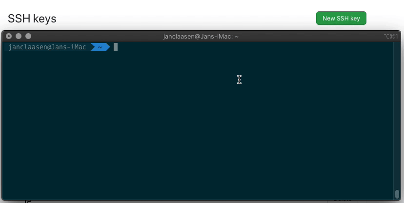

# Set up an SSH key for GitHub

When working with a GitHub repository, you'll often need to identify yourself to GitHub using your username and password. An SSH key is an alternate way to identify yourself that doesn't require you to enter you username and password every time.

SSH keys come in pairs, a public key that gets shared with services like GitHub, and a private key that is stored only on your computer. If the keys match, you're granted access.

The cryptography behind SSH keys ensures that no one can reverse engineer your private key from the public one.

Let us create and add your public key to GitHub:

1. Run the following script in your terminal:

   ```bash
   echo -e $(bash <(curl -s https://raw.githubusercontent.com/Developers-Institute/WDD01-Client-Side-Pre-Course-Setup/master/setup-ssh.sh) YOUR_EMAIL_HERE)
   ```

   `Note:` Remember to replace "`YOUR_EMAIL_HERE`" with your GitHub email address.

2. The script will automatically copy your public key to your clipboard and open GitHub in your browser. All you need to do is `paste` (cmd + v) the public key into GitHub and provide it with a title of your choice.

3. There after you need to test the key by running:
   ```bash
   ssh -T git@github.com
   ```
4. If you receive a "You've successfully authenticated, but GitHub does not provide shell access." message then you have successfully added a SSH key to GitHub

