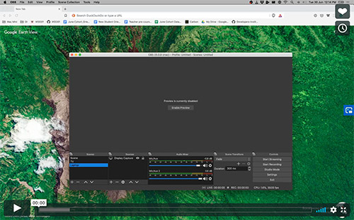

# Learn the basics of Git

Git is one of the core tools that developers use daily. Watch the [Git Basics](https://git-scm.com/videos) introductory video series on the Git version control system. There is loads of information to absorb, but we only need to know a small amount of it for now. The main thing to learn is how to `git clone`, `git add`, `git commit` and `git push`.

## Video tutorial of a GitHub workflow using Visual Studio Code:

## Self-learning exercise

Work through the [Quick Start tutorial](https://help.github.com/en/github/getting-started-with-github/quickstart) to get familiar with common GitHub tasks.

At this stage you should have the basic understanding of how to `git clone`, `git add`, `git commit`, `git push`.

`Note:` getting to grips with git is a marathon and not a sprint. So take it easy.

## Optional Content

Get to know git and GitHub better:

- [GitHub Guides](https://guides.github.com/)
- [GitHub Training & Guides YouTube channel](https://www.youtube.com/user/GitHubGuides/featured)