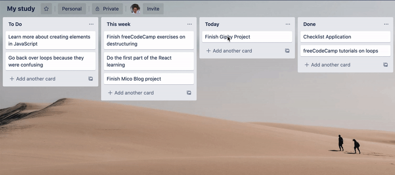

# Getting ready to learn

Learning is hard work. Take some time today to think about how you are going to make the most of your time. Below are some helpful tools and links to get you started

- **[Trello](https://trello.com)** - This is a great tool for task management. Create columns such as "To Do", "Today", "Done", then create tasks and drag them between columns. You could use this to keep on top of your workload, and help you focus on one thing at a time

  

- **[Notion](https://www.notion.so/personal)** - This is like having a second brain. Capture all your notes in one place so you can easily refer back to them. Even if you don't use Notion, make sure you have some tool for capturing notes as you learn.

- **[RunJS](https://runjs.dev/)** - A tool for quickly writing and running JavaScript. Great for practicising or coding along with tutorials