# Get to know your accountability buddy

This practice challenge will help you get familiar with `git`, and also help you get to know your accountability buddy a bit better.

## Part A: Create questions for your accountability buddy

1. Make a new private repository
   1. Go to [https://github.com](https://github.com), and make sure you are logged in
   2. Click the `New` button, near the top left of the page, to create a new Repository

      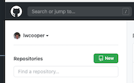

   3. Name the repository `my-accountability-buddy`
   4. Make the respostiory `Private`
      
      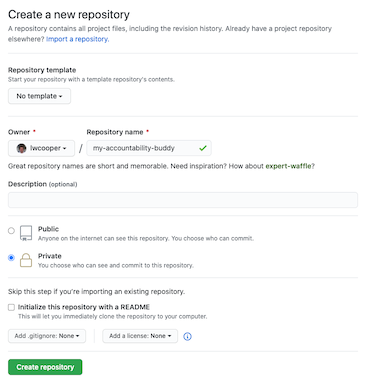

2. Give your accountability buddy and your instructor access to your repo
   1. Once your repository is created, go to the `Settings` tab
   2. Click the `Manage Access` menu item

      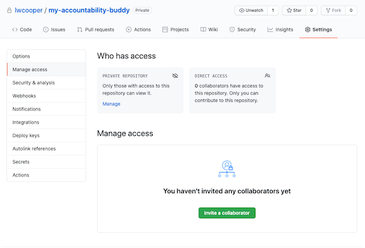

   3. Click the `Invite a collaborator` button
   4. Add your instructor and your accountability buddy by email or github username. You might have to ask them for this information.
   
      

3. Open VS Code, and clone your new repo
   1. If you have no projects open in VS Code, you can click the `Source Control` tab, and click `Clone a repository`

      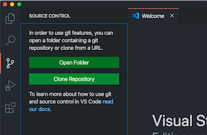

   2. If you already have a project open, you can use keyboard shortcuts. Type: `cmd-shift-p` to open the command pallete. Then type: `git clone`, you should see it appear in the dropdown, push enter. Select `Clone from Github` and then search for your repo: `my-accountability-buddy`

      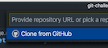
      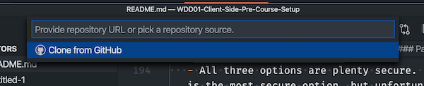

4. Once cloned, open your project. You can do this by clicking `Open` in the popup that appears in the bottom right of VS Code

   

5. Create a new file in your repo, named `my-accountability-buddy.txt`. You can do this by selecting `File -> New File` from the VS Code toolbar. This is at the very top of your screen, in the Mac menu.

   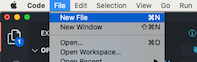

6. Paste the following template into the `my-accountability-buddy.txt` file

   ```
   If you picture yourself in the future, after completing this course, what do you see? And how would that affect your life?

   Do you have any prior knowledge in programming?

   What's your favorite way to treat yourself?
   
   What do you do on Sundays?

   What makes you grumpy?

   Can you tell me a bit about either your ethnic culture (Māori, Tongan, Aussie, Kiwi, South African etc), or your personal culture (foody, outdoor, musician, etc)

   How does your culture, influence how you go by your daily routine?

   ```

7. Add your own questions at the end of the file
8. Make sure you save the file. You can tell if a file is unsaved in VS Code, because there will be a dot next to the filename in the file tab. When you save a file, the dot disappears. 

   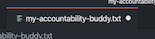
   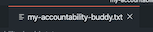

9. Commit and push your file back to github
   1. Open your VS Code terminal, by selecting `Terminal -> New Terminal` from the VS Code menu
   
      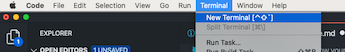
   
   2. Once the terminal pops up in VS Code, check out what state `git` is in, by typing `git status`. You should see that your `.txt` file is untracked
   
      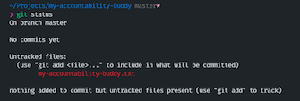
   
   3. Add your file to `git` by typing: `git add my-accountability-buddy.txt`. Again, see what change this has made to `git` by typing: `git status` in your terminal. You should see the file has moved into `Changes to be committed`
   4. Commit this file to `git` by typing: `git commit -m "My accountability buddy questions"`. 
   5. Push this change back to github, by typing `git push origin`
   6. Find your repository in Github, and check that the file was pushed correctly

      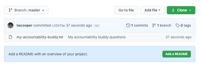

10. Copy and paste the URL for the repository, and share it with your accountability buddy, so they can complete Part B below

    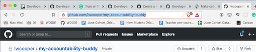

## Part B: Answer questions from your accountability buddy

When your accountability buddy sends you a link to the repo, you can follow the steps below

1. Clone the repo provided to you by your accountability buddy. You can follow the instructions in Part A for cloning a repo
2. Open the repo in VS Code
3. Open `my-accountability-buddy.txt`, and answer the questions
4. Once you have finished answering the questions, save your file
5. Add, commit and push your changes using Git. You can follow the instructions in Part A for commiting and pushing your changes to Github.
6. Let your accountability buddy know you have answered the questions
